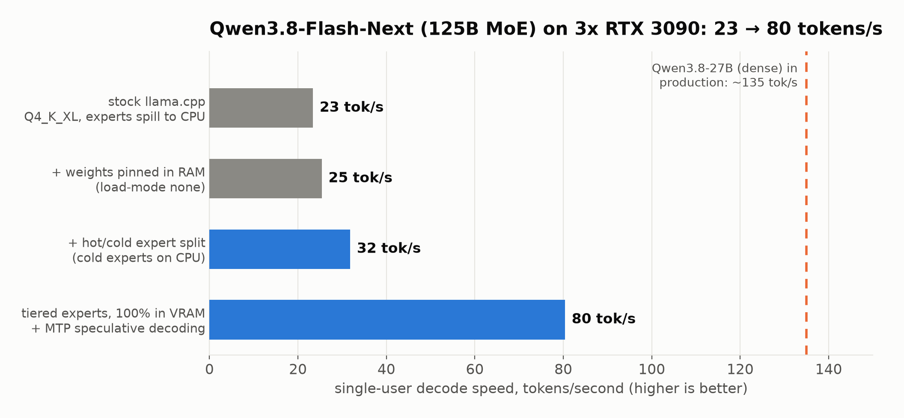
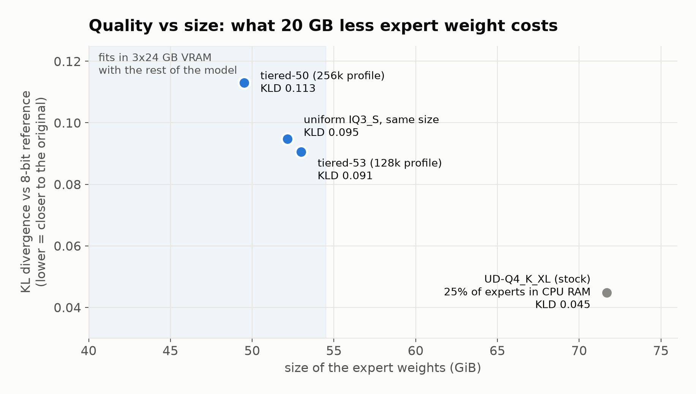

# Qwen3.8-Flash-Next (125B MoE) on 3x RTX 3090, entirely in VRAM

**Frequency-tiered MoE experts + a patched llama.cpp.** 23 → 80 tokens/s single-user decode on three 24 GB consumer GPUs,
128k context (or 256k with a smaller profile), quality close to the 8-bit reference.



Write-up with diagrams and a plain-language glossary: **[Qwen3.8-Flash-Next (125B) on Three RTX 3090s at 80 Tokens/s: Teaching llama.cpp Which Experts Matter](https://dev.to/sikamikanikobg/i-ran-a-125b-model-on-three-rtx-3090s-at-80-tokenss-by-teaching-llamacpp-which-experts-matter-4ioi)** (dev.to).

## the idea

Qwen3.8-Flash-Next has 512 routed experts per layer (10 active per token). Routing is heavily skewed: in the average
layer the most-used 25% of experts serve 52% of routed tokens and the top 80% serve 95%
([chart](charts/routing_skew.png), from the imatrix `counts`). Stock llama.cpp can only place a layer's experts as one
tensor, so when the model doesn't fit it pushes whole layers of experts, popular or not, into (slow) system RAM.

This repo does two things:

1. **`tools/expert_tiers.py`** re-packs a high-precision GGUF (Q8_0/BF16) into up to 3 **tiers** per layer. Experts are
   reordered hottest-first and each tier is re-quantized with ggml's own quantizers (per-expert imatrix) at its own type,
   under a total byte budget chosen so the whole model fits in VRAM. The router rows are permuted to match.
   Output is a 2-shard GGUF; the 51 GB n-gram table goes to shard 2, which can be hard-linked between variants.
2. **`patches/0002-tiered-experts-hot-cold-split.patch`** teaches llama.cpp to run it:
   - `ggml_mul_mat_id_set_range(t, lo)`: a `mul_mat_id` over an expert subset. Ids outside `[lo, lo + n)` (and negative
     ids) are skipped and produce zero rows, on the CPU (incl. repack) and on CUDA (MMVQ, fused gate/up/GLU MMVQ, MMQ).
   - qwen4exp loads pre-tiered GGUFs (`qwen4exp.expert_tiers`) and runs every tier against the same router output.
   - Alternatively `LLAMA_EXPERT_SPLIT=<file>` splits a normal GGUF at load time into a hot (GPU) and cold tier
     (`-ot "\.cold$=CPU"`, needs `--load-mode none`); `tools/make_expert_split.py` writes that file.

`patches/0001-qwen4exp-mtp-pr28243.patch` is the unmerged MTP (multi-token prediction) support for qwen4exp from
[llama.cpp PR #28243](https://github.com/ggml-org/llama.cpp/pull/28243), included for convenience. Base: llama.cpp `81bc6b8`.

## results (3x RTX 3090, dual Xeon E5-2660 v4, 60 GB RAM)

Single request, 256 generated tokens, greedy; warm medians unless noted. Raw data: [`results/`](results/).

| configuration | where the experts live | decode tok/s | prefill @4k tok/s |
|---|---|---|---|
| stock llama.cpp, UD-Q4_K_XL, auto-fit | GPU + 25% in CPU RAM | 23 | 47–306 (page-cache thrash) |
| + `--load-mode none` | GPU + 25% in CPU RAM | 25 | 658–725 |
| + hot/cold split (this patch) | GPU + coldest 19% in CPU RAM | 32 | 163–178 |
| **tiered-53 + MTP (this repo)**, 128k ctx | **100% GPU** | **79–92** | **541–947** |
| tiered-50 + MTP, 256k ctx, q8_0 KV | 100% GPU | 77 | see [chart](charts/speed_vs_context.png) |

Quality vs Q8_0 (wikitext-2, 12 x 2048 tokens):

| model | expert GiB | PPL ratio | mean KLD | same top token | GSM8K (200) |
|---|---|---|---|---|---|
| UD-Q4_K_XL (stock, needs CPU offload) | 71.7 | 1.009 | 0.045 | 93.7% | – |
| **tiered-53** | 53.0 | 1.019 | 0.091 | 91.1% | 95.5% |
| uniform IQ3_S / MXFP4 (same size) | 52.2 | 1.030 | 0.095 | 91.0% | – |
| tiered-50 (256k profile) | 49.5 | 1.032 | 0.113 | 90.1% | – |



## run it

```bash
git clone https://github.com/ggml-org/llama.cpp && cd llama.cpp && git checkout 81bc6b8
git apply ../patches/0001-qwen4exp-mtp-pr28243.patch ../patches/0002-tiered-experts-hot-cold-split.patch
cmake -B build -DGGML_CUDA=ON -DCMAKE_CUDA_ARCHITECTURES=86 && cmake --build build -j

# sources: unsloth/Qwen3.8-Flash-Next-GGUF  Q8_0/*, imatrix_unsloth.gguf_file, MTP/mtp-Qwen3.8-Flash-Next-shared-Q8_0.gguf
python tools/expert_tiers.py plan  --src Q8_0/Qwen3.8-Flash-Next-Q8_0-00001-of-00006.gguf --imatrix imatrix_unsloth.gguf \
       --budget-gib 53 --gu Q6_K,IQ4_XS,IQ3_XXS --dn Q8_0,IQ4_NL,MXFP4
python tools/expert_tiers.py write ...same args... --out fn-tier53.gguf       # ~35 min, needs gguf-py + libggml-base.so

# draft head: 4-bit experts so it fits next to the model
llama-quantize --allow-requantize --tensor-type ffn_gate_exps=iq4_xs --tensor-type ffn_up_exps=iq4_xs \
  --tensor-type ffn_down_exps=iq4_nl mtp-Qwen3.8-Flash-Next-shared-Q8_0.gguf mtp-shared-iq4.gguf Q8_0

# 128k profile
llama-server -m fn-tier53-00001-of-00002.gguf -ngl 99 -ts 16,16,16 -c 131072 -b 1024 -ub 256 -fa on --jinja \
  -md mtp-shared-iq4.gguf --spec-type draft-mtp --spec-draft-n-max 4
# 256k profile: tier-50 model, -c 262144 -ctk q8_0 -ctv q8_0, -ts 16,17,15
```

`-ub 256` matters: at 4 tiers of MoE matmuls the CUDA memory pool grows during long prefills, and with 512 the cards run
out of memory. `-ts` should leave the card that holds the output head a little lighter.

For day-to-day serving, `scripts/serve-flash-next.sh` wraps all of this (plus vision, below) in a restart-on-boot
container built from `docker/Dockerfile`: `PROFILE=128k LAB=/path/to/lab scripts/serve-flash-next.sh`.

## images and video

Qwen3.8-Flash-Next is multimodal, and llama-server serves images and video through the OpenAI API
(`image_url` / `video_url` content parts, data URIs or URLs) once two things are in place:

1. **The vision projector.** Download `mmproj-F16.gguf` (0.9 GB) from `unsloth/Qwen3.8-Flash-Next-GGUF` and pass
   `--mmproj mmproj-F16.gguf`. Without it, image requests fail with HTTP 500 ("image input is not supported").
2. **ffmpeg in the container.** Video frames are decoded with `ffprobe`/`ffmpeg`; without them video requests fail
   with HTTP 400 and the server log says `ffprobe failed on buffer`. `docker/Dockerfile` installs it.

Where the projector runs matters more than anything else here:

| projector placement | 1536x864 photo, 200-token answer | 5 s 640x360 clip |
|---|---|---|
| `--no-mmproj-offload` (CPU) | 61 s | – |
| `-mmdev CUDA1 --image-max-tokens 1024` | **4 s** | **6.4 s** |

The GPUs are nearly full with the 128k profile, so put the projector on the card with the most free memory
(`-mmdev CUDA1` here) and cap image size with `--image-max-tokens 1024` to bound its scratch memory. With that,
a 57k-token text prompt still runs without running out of memory. Long videos become many frames, and every frame
costs context and prefill time: short clips are quick, multi-minute videos are not.

```bash
curl http://localhost:18100/v1/chat/completions -H "Content-Type: application/json" -d '{
  "model": "qwen3.8-flash-next",
  "messages": [{"role": "user", "content": [
    {"type": "text", "text": "What text appears in this video?"},
    {"type": "video_url", "video_url": {"url": "data:video/mp4;base64,<...>"}}]}]}'
```

## tools

| file | what |
|---|---|
| `tools/expert_tiers.py` | plan / write a frequency-tiered GGUF |
| `tools/make_expert_split.py` | hot/cold split file for `LLAMA_EXPERT_SPLIT` (runtime split, cold tier in CPU RAM) |
| `tools/balance_ts.py` | layer split across GPUs for a hot/cold split |
| `tools/bench.py` | single-stream speed bench against llama-server (server-side timings) |
| `tools/gsm8k_eval.py`, `tools/needle.py` | GSM8K and needle-in-a-haystack checks |
| `tools/make_charts.py` | the charts in this README from `results/` |
| `scripts/serve-flash-next.sh` | production launcher: 128k/256k profile, vision + video, MTP, restart-on-boot |
| `docker/Dockerfile` | build/runtime image (CUDA 13, cmake, ffmpeg for video) |

## caveats

Single-user numbers. The tier planner's error model is a heuristic, and tiering beat uniform quantization at equal size
on perplexity (1.9% vs 3.0% drift) but only slightly on KLD. Quality checks are wikitext KLD, GSM8K and a needle test,
not agentic benchmarks. Built and measured with Claude Code as the engineering assistant.

## license

MIT for the tools and the tiering patch. Patch 0001 is from llama.cpp PR #28243 (MIT, its authors).
